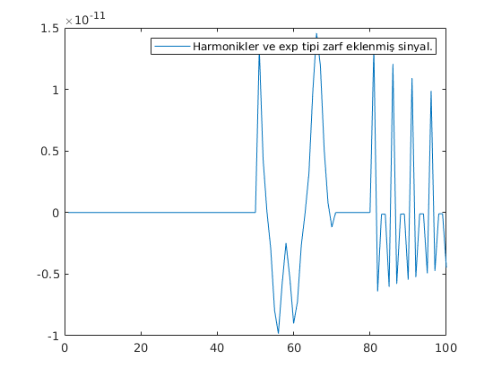

# Sinyal İşleme Dersi 2020 Projesi 


 *Ad-Soyad: Zeki Ahmet Bayar*

 *Öğrenci No: 030117092*

 *Ders Adı: Sinyal İşleme*
 
 *Proje: MATLAB ile sentezleme*


# Hedef 1 

# Parse Edilmiş Veri Analizi

 *MuseScore'da yazılan Ata Barı türküsü ParseMusicXML fonksiyonu kullanılarak parse edildi. Bu sayede 140x19'luk bir matris elde dildi. Müziği sentezlemek için kullanılacak matris sütunları :*

 
 *2. Sütun : Nota ölçülerini içeren matris sütunu. 

 *4. Sütun : MIDI protokolüne ait numaraları içeren matris sütunu.

 *7. Sütun : Notanın devam ettiği süre.

 *8. Sütun : Dizekleri tutan sütun.


## Bu Verileri Nasıl Kullanacağız

 > fm  =  2(m−69)/12(440 Hz)

 *Yukarıdaki formülde m değeri yerine 4. sütundan alınan veriler yerleştirilerek her bir notanın frekansını hesaplanacak. Sonrasında :*


 > x(t) = A * (cos(2 * pi * frekans * süre))

 *Formülünde frekans yerine konularak, her bir nota için elde ettiğimiz x(t) sinyallerini ard arda ekleyerek asıl sinyal elde edilecek.*


 > tnota = 0 : artışmiktarı : parser(k,7) (*MATLAB*)

 *Bunun yanında t zamanını elde etmek için, tüm notalarda yukarıdaki formül kullanılacak. Sonuçlar toplandığında asıl sinyalin t zamanı elde edilmiş olacak.*


# *Hedef 2*


# *Note.m dosyası*


### *Note fonksiyonu* 


```matlab
function freq=note(sayi)
freq=(2^((sayi-69)/12))*440;
end
```

*Yukarıda verilmiş olan note fonksiyonuna, sentez kodunda parse edilen verinin 4. sütununda bulunan notaların MIDI numaraları sırasıyla parametre olarak gönderilmektedir. note fonksiyonu MIDI numaralarını kullanarak her nota için frekansı döndürmektedir.*


```matlab
freq(k,1)=note(parser(k,4));
```

*Döndürdüğü frekans değerlerini de yukarıda göründüğü gibi freq isimli matrisin ilk sütununa yazdırmaktadır.*


# *Sentez.m dosyası*


**Sentez kısmında amaç, note ve parseMusiXML fonksiyonlarından edindiğimiz değerler ile melodiyi tekrar sentezlemektir.**


**1) .musicxml uzantılı dosyanın parse edilmesi.**


```matlab
parser=parseMusicXML("muzik/nota.musicxml");
```

*parseMusicXML fonksiyonu, parametre olarak aldığı nota.musicxml dosyasını ayrıştırarak parser ismindeki matrise yazmaktadır. Buradan sonra ayrıştırılmış veriye ihtiyaç duyulan her noktada bu matris, farklı sütunlarına erişilerek kullanılacaktır.*


**2) Seçim değişkenleri.**


```matlab
zarf_Secim = 1; % 1 -> ADSR , 0 -> EXP Envelope.
har_Kac =1 ; % 1-> Asıl sinyali çalar.
```

*Proje hedeflerinde bulunan görevler ışığında oluşturulan bu iki değişken farklı değerlerine göre melodinin farklı şekillerde sentezlenmesine ve ekrana buna göre grafikler çizdirilmesi işine yaramaktadır.*


**2.1) zarf_Secim değişkeni.**


*zarf_Secim değişkeni 1 olduğunda ADSR tipi zarfa sokulup yankı eklenen melodi çaldırılmakta ve ekrana ayrı ayrı ADSR tipi zarfa sokulmuş ve bunun üzerine yankı eklenmiş melodinin grafikleri çizdirilmektedir.*

*zarf_Secim değişkeni 0 olduğunda Exponential tipi zarfa sokulup yankı eklenen melodi çaldırılmakta ve ekrana ayrı ayrı Exponential tipi zarfa sokulmuş ve bunun üzerine yankı eklenmiş melodinin grafikleri çizdirilmektedir.*


**2.2) har_Kac değişkeni.**


*har_Kac değişkeni program içinde bulunan if-else deyiminin içine yerleştirilmiş bir for döngüsü ile melodinin harmoniklerini üretip bu harmoniklerle asıl sinyali toplayarak çaldırmaktadır. har_Kac değeri 1 olduğunda if-else yapısı sayesinde melodinin harmonikleri oluşturulmamaktadır. 1'den sonraki her değer için işleyen bu sistem, melodinin harmonikleri ile toplanmış halini çaldırmamıza ve grafiklerini çizdirmemize olanak sağlamaktadır.*


**3) Tanımlamalar**


```matlab
A = 1; % Genlik değeri 1 olarak ayarlandı.
freq=zeros(140,1); % Frekansların tutulacağı matris boş olarak oluşturuldu.
exp_Toplam = []; % Exp tipi zarfa girmiş notaların toplamı.
ADSR_Toplam = []; % ADSR tipi zarfa girmiş notaların toplamı.
```


**3.1) A değişkeninin tanımlanması.**


*A değişkeni program içerisinde üretilen nota sinyallerinin genlik değeridir. Varsayılan olarak 1 ayarlanan bu değişken, har_Kac değişkeni 1'den farklı bir değer alırsa o değer ile çarpılarak harmoniklerin elde edilmesinde kullanılmaktadır.*


**3.2) freq matrisinin tanımlanması.**


*Frekansları tutmak amacıyla kullanılan freq matrisi programın başında, MIDI numaralarının sayısı esas alınarak, zeros fonksiyonu ile boş bir şekilde oluşturulmuştur.*


**3.3) ADSR_Toplam ve exp_Toplam matrislerinin tanımlanması.**


*Bu matrislerde teker teker zarfa sokulan notalar üst üste eklenerek melodi oluşturulmaktadır.*


**4) For döngüsünün bitiş değerinin oluşturulması.**


```matlab
freq_Uzunluk = size(freq);
|-for k=1:freq_Uzunluk
|
|	.
|   (işlemler)
|	.
|
|-end

```

*freq_Uzunluk değişkeninde, freq matrisinin uzunluğu tutulmaktadır. Bu değişken ile for döngüsünün bitiş değerini belirlemek amaçlanmaktadır.*


**For döngüsü başlangıcı**


**5) Frekans değerlerinin bulunması.**


```matlab
freq(k,1)=note(parser(k,4));
```

*Programın başında boş olarak oluşturulan (0'lar matrisi) freq matrisinin birinci sütununa note fonksiyonuna parametre olarak gönderilen, parse edilmiş verileri bulunduran parser matrisinin 4. sütununda tutulan notaların MIDI numaraları yardımıyla yazılmaktadır.*


**6) t zamanının hesaplanması.**


```matlab
zaman = 0: 1/10000 :parser(k,7);
```

*t zamanı, zaman değişkeninde, 1/10000 örnekleme frekansı ile parser fonksiyonunun 7. sütunu kullanılarak oluşturulmuştur.*


**7) Nota Sinyalinin oluşturulması.**


```matlab
nota_Sinyal = A * cos(2*pi*freq(k,1)*zaman);
```

*nota_Sinyal değişkeni notaların frekans ve zaman değerleri kullanılarak, nota sinyallerinin oluşturulmasını sağlamaktadır.*


*Sinyalin zarfsız ve yankısız halinin grafiği.*


**8) Harmoniklerin oluşturulması.**


  ```matlab
  harmonik_Sinyal=nota_Sinyal;
  if(har_Kac~=1)
  for n = 2:har_Kac
    A = 1/n;
    har_cosx = A * cos(2 * pi * freq(k,1) * zaman * n); 
    harmonik_Sinyal = harmonik_Sinyal + (har_cosx);
  end
  end
  ```

*Notanın harmonikleri oluşturulurken nota_Sinyal, harmonik_Sinyal'e eşitlenmiştir. Bunun sebebi programın daha okunabilir bir hale gelmesidir.*

*Burada bulunan if-else deyimi har_Kac seçimine göre harmoniklerin oluşturulup oluşturulmayacağına karar verir. Eğer har_Kac değeri 1'den farklı ise programın bu parçası çalışmaktadır. For döngüsünün 2'den başlamasının sebebi de budur.*

*Değişkenlerin tanımlanması kısmında anlatıldığı üzere (3.1) A değişkeni yerine o esnada oluşturulan kaçıncı harmonikse o (1/n) tipinde yazdırılmaktadır.*

*Sonrasında ise harmonik sinyaller oluşturulup, asıl sinyalin üzerine toplanmaktadır.*


*har_Kac = 3 değeri için harmonik eklenmiş sinyal.*


**9) Sinyalin istenen zarf tipine sokulması.**


**9.1) Sinyalin ADSR tipi zarfa sokulması.**


```matlab
  if zarf_Secim == 1 
      dur = length(zaman);
      ADSR = [linspace(0,1.5,floor(dur/5)) linspace(1.5,1,ceil(dur/10)) ones(1,floor(dur/2)) linspace(1,0,floor(dur/5))];
      ADSR_Sinyal = ADSR .* harmonik_Sinyal; 
      ADSR_Toplam = [ADSR_Toplam ADSR_Sinyal]; 
  ```

*zarf_Secim değeri 1 iken notalar ADSR tipi zarfa sokulmaktadır. If deyimi bunun içindir.*

*ADSR matrisinde zarf oluşturulmuştur.*

*ADSR_Sinyal matrisinde ise harmonik_Sinyal, ADSR tipi zarfa sokularak ADSR_Sinyal matrisine atılmıştır.*

*ADSR_Toplam matrisinde ise zarf işlemine tabi tutulan notalar üst üste eklenerek zarflı melodi oluşturulmaktadır.*


*ADSR tipi zarfa sokulmuş sinyalin grafiği.*


**9.2) Sinyalin Exponential tipi zarfa sokulması.**


```matlab
  elseif zarf_Secim == 0 
    
      exp_Zarf = exp(-zaman / parser(k,2));
      exp_Sinyal = exp_Zarf .* harmonik_Sinyal; % Sinyallerin zarfa sokulması işlemi.
      exp_Toplam = [exp_Toplam exp_Sinyal];

      end
  ```

*zarf_Secim değeri 0 iken notalar Exponential tipi zarfa sokulmaktadır. If deyimi bunun içindir.*

*exp_Zarf matrisinde zarf oluşturulmuştur.*

*exp_Sinyal matrisinde ise harmonik_Sinyal, Exponential tipi zarfa sokularak exp_Sinyal matrisine atılmıştır.*

*exp_Toplam matrisinde ise zarf işlemine tabi tutulan notalar üst üste eklenerek zarflı melodi oluşturulmaktadır.*


*Exponential tipi zarfa sokulmuş sinyalin grafiği.*


**For döngüsünün bitişi.**


**10) Zarf seçimine göre yankı eklenmesi ve grafiklerin çizdirilmesi.**


**10.1) ADSR zarf seçimine göre yankı eklenmesi ve grafiklerin çizdirilmesi.**


```matlab

 if zarf_Secim == 1
     
     ADSR_Toplam = (ADSR_Toplam)';
     reverb = reverberator('PreDelay',0.15,'WetDryMix',0.2);
     reverb_ADSR=reverb(ADSR_Toplam);
     sound(reverb_ADSR,10000)
     
     plot(ADSR_Toplam)
     figure
     plot(reverb_ADSR)

```

*İlk satırda göründüğü üzere oluşturulan if-else deyimi zarf_Kac seçimine göre hareket etmektedir. Eğer zarf_Kac değişkeninin değeri 1 olarak atanmışsa program melodiyi ADSR tipi zarfa sokup, zarfa sokulmuş melodiye yankı ekleyip, bu zarf tipine ait grafikleri çizdirmek için bulunan kod bloklarını çalıştırmaktadır.*

*ADSR tipi zarfın seçildiği düşünülsün, if-else deyiminin içindeki ilk satır ADSR zarfına sokulmuş melodiyi tutan matrisin transpozesi alınmaktadır. Bunun sebebi reverb fonksiyonunun matrisi satırlar matrisi olarak istemesidir.*

*Hedef2'de verilen görevlere bağlı olarak ekrana, ADSR tipi zarfa sokulmuş yankı eklenmeyen melodinin grafiği ve ADSR tipi zarfa sokulmuş yankılı melodinin grafiği, plot fonksiyonu ile çizdirilmiştir.*


*ADSR tipi zarfa sokulmuş, yankı eklenmiş sinyalin grafiği.*


**Reverb fonksiyonunun uygulanması (10.3) numaralı adımda detaylıca anlatılmıştır.**


**10.2) Exponential zarf seçimine göre yankı eklenmesi ve grafiklerin çizdirilmesi.**


```matlab

 elseif zarf_Secim == 0
        
     exp_Toplam = (exp_Toplam)';
     reverb = reverberator('PreDelay',0.15,'WetDryMix',0.2);
     reverb_Exp=reverb(exp_Toplam);
     sound(reverb_Exp,10000)

     plot(exp_Toplam) 
     figure
     plot(reverb_Exp)
     
    end

```

*Eğer zarf_Kac değişkeni 0 olarak atanmışsa program melodiyi Exponential tipi zarfa sokup, zarfa sokulmuş melodiye yankı ekleyip, bu zarf tipine ait grafikleri çizdirmek için bulunan kod bloklarını çalıştırmaktadır.*

*Exponential tipi zarfın seçildiği düşünülsün, if-else deyiminin içindeki ilk satır Exponential zarfına sokulmuş melodiyi tutan matrisin transpozesi alınmaktadır. Bunun sebebi **reverb** fonksiyonunun matrisi satırlar matrisi olarak istemesidir.*

*Hedef2'de verilen görevlere bağlı olarak ekrana, Exponential tipi zarfa sokulmuş yankı eklenmeyen melodinin grafiği ve Exponential tipi zarfa sokulmuş yankılı melodinin grafiği, **plot** fonksiyonu ile çizdirilmiştir.*


*Exponential tipi zarfa sokulmuş, yankı eklenmiş sinyalin grafiği.*


**10.3) Reverb Fonksiyonu** [Referans : Mathworks/Reverberator](https://www.mathworks.com/help/audio/ref/reverberator-system-object.html "Mathworks")


**10.3.1) Reverb fonksiyonunun tanımlanması.**


>reverb = reverberator, bir ses sinyaline yapay yansıma ekleyen bir reverb sistemi nesnesi oluşturur.

>reverb = reverberator (Name, Value) her özellik adını belirtilen değere ayarlar. Belirtilmemiş özelliklerin varsayılan değerleri vardır.


**10.3.2) Reverb fonksiyonunun açıklaması.**


>Aksi belirtilmedikçe, özellikler değiştirilemez; bu, nesneyi çağırdıktan sonra değerlerini değiştiremeyeceğiniz anlamına gelir. Onları çağırdığınızda nesneler kilitlenir ve serbest bırakma işlevi onları açar.

>Bir özellik ayarlanabilir ise, değerini istediğiniz zaman değiştirebilirsiniz.


**10.3.3) Reverb fonksiyonunun parametreleri.** 


**1) PreDelay :** [0, 1] aralığında gerçek bir skaler olarak belirtilen saniye cinsinden yankılanma için ön gecikmedir.

Yankılanma için ön gecikme, doğrudan duyma sesi ile ilk erken yansıma arasında geçen süredir.

Ayarlanabilir mi ? : Evet

Veri Tipleri: Single | Double


**2) WetDryMix :** WetDry Mix, [0, 1] aralığında gerçek bir pozitif skaler olarak belirtilir.

WetDry Mix, reverberatör sistem nesnenizin verdiği wet (reverberated), dry (orijinal) sinyallerin oranıdır.

Ayarlanabilir: Evet

Veri Tipleri: Single | Double


**3) SampleRate :** Pozitif skaler olarak belirtilen Hz cinsinden giriş örnek oranı.

Ayarlanabilir: Evet

Veri Tipleri: Single | Double


# *16. Ölçüdeki notalar için elde edilen grafikler*


*16. ölçü için sade sinyalin grafiği.*


*16. ölçü için harmonikler ve ADSR tipi zarf eklenmiş sinyalin grafiği.*


*16. ölçü için harmonikler, ADSR tipi zarf ve yankı eklenmiş sinyalin grafiği.*



*16. ölçü için harmonikler ve Exponential tipi zarf eklenmiş sinyalin grafiği.*


*16. ölçü için harmonikler, Exponential tipi zarf ve yankı eklenmiş sinyalin grafiği.*


# *Referanslar*


- 10.3 numaralı adım, [Mathworks/Reverberator](https://www.mathworks.com/help/audio/ref/reverberator-system-object.html "Mathworks").

- parseMusicXML fonksiyonu, [github/fabiozeh](https://gist.github.com/fabiozeh/62018d04ee9f507bf800d157e89c579f "Github").


# *Lisans* 

Bu yazılım, MIT lisansı ile lisanlanmıştır, tamamen **özgür bir yazılımdır**. 


 


